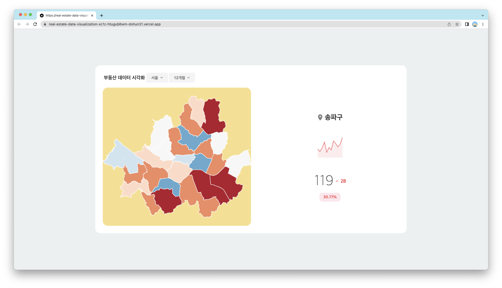

<p style="text-align: right">
    
</p>

안녕하세요! 프론트엔드개발팀 신입 개발자 백도훈입니다.

줌인터넷 입사 이후에 약 5주동안 진행한 파일럿 프로젝트 진행 과정에 생긴 고민들과 해결 과정을 공유하려고 합니다.

# 목차

```md
1. 개요
2. 기술 스택
3. 디자인
4. 기능
5. 프로젝트 설계
6. 기술적 고민
7. 마치며
```

<br />

# 1. 개요

## 주제

이번에 진행한 파일럿 프로젝트의 주제는 **부동산 데이터 시각화**입니다.  
Next.js, 차트, 시각화 라이브러리 등 **실무에 필요한 기술 역량을 강화**하는것이 이번 프로젝트의 목표입니다.

## 요구 사항

- 지역/기간 선택에 따라 변동률 데이터가 변경되어야 합니다
  - 지수 등락율에 따라 색상을 다르게 보여주어야 합니다.
- 지역 선택 시 상세 정보를 보여주어야 합니다.

<br />

# 2. 기술 스택

```markdown
- Next.js
- Typescript
- Emotion.js
- Storybook
- d3
- Recoil
```

이번 프로젝트의 주제가 지도에 시각화를 해야하기 때문에 지도를 그릴 수 있어야 합니다.

지도 라이브러리는 대표적으로 **leaflet**, **mapbox**, **d3-geo**가 있습니다. leaflet과 mapbox는 지도에 대한 모든 기능을 제공해주는 지도 라이브러리입니다. 지역, 도로 등 모든 정보들을 가지고 있습니다. d3는 데이터 시각화 라이브러리입니다. d3-geo를 이용해 지도를 시각화할 수 있습니다. d3를 사용한다면 지도 이외에도 다양한 차트를 사용할 수 있습니다. 하지만 leaflet, mapbox와 비해 지도 관련 기능은 부족합니다.

요구 사항을 보면 leaflet이나 mapbox처럼 **구체적인 지도 정보**가 필요해 보이지 않습니다. 각 지역의 건물, 도로와 같이 구체적인 정보보단 행정구역의 구분 정도만 필요합니다. 정리하면 "**지도를** 그린다."보단 "지도를 **그린다.**"에 더 가깝습니다.

따라서 geoJson으로 지도를 그려줄 수 있고 다른 차트들까지 사용할 수 있는 d3 라이브러리를 선택했습니다.

<br />

# 3. 디자인



데이터 시각화에선 색상 배합이 매우 중요합니다.


- 정성형 배합: 선호하는 음식, 계절과 같이 각기 다른 데이터를 표현할 때 유용합니다.
- 순차형 배합: 인구 밀도와 같이 한가지 공통된 척도에 대한 정도의 표현을 나타낼 때 유용합니다.
- 양방향 배합: 찬반 투표나 주식 차트 등 대립되거나 상반된 데이터를 표현할 때 유용합니다.

이렇게 색상 배합은 데이터의 표현 방식만큼 중요한 요소입니다.


따라서 우리에게 친숙하고 관습적인 증감의 표시인 **빨간색과** **파란색을** 활용해 확실하게 지수의 증감을 표현을 했습니다.

<br />

# 4. 기능


> 사용자는 지역과 기간을 선택할 수 있고, 선택한 정보에 맞는 데이터를 볼 수 있습니다.

<br />


> 지도에서 한 곳을 클릭하면 지역에 대한 요약 정보를 볼 수 있습니다.

<br />


> 요약 정보를 클릭하면 디테일 페이지로 이동해 자세한 정보를 확인할 수 있습니다

<br />


> 라인 차트에 마우스를 올리면 해당 월에 부동산 지수가 얼마인지 확인할 수 있습니다.

<br />


> 월 변동률을 테이블로도 확인할 수 있습니다.

<br />

# 5. 프로젝트 설계

## 아토믹 디자인 패턴

디자인에 겹치는 컴포넌트들이 많이 존재합니다. 그리고 앞에서도 언급했듯이 프로젝트를 진행하면서 디자인이 계속 변경되었기 때문에 **공통 컴포넌트**들을 미리 만들어둔다면 디자인 변경에 빠르게 대응할 수 있을 것 이라고 기대했습니다. 따라서 이번 프로젝트는 아토믹 디자인 패턴을 사용했습니다.


아토믹 디자인 패턴은 다음 그림으로 표현할 수 있습니다.

Atom(원자)들이 서로 결합하여 Molecules(분자)가 되고, Molecules(분자)들이 서로 결합해 Organisms(유기체)가 됩니다. 이런식으로 가장 작은 단위였던 Atom들이 서로 결합해 원하는 컴포넌트, 페이지를 생성합니다.

### Atom


Atom은 `Text`, `Icon`, `LineChart`, `Badge`와 같이 더 이상 분해할 수 없는 기본 컴포넌트입니다. Atom은 다른 단계에 비해 추상화 단계를 높게 설정해 다양한 맥락에서 사용될 수 있도록 했습니다.

> LineChart는 path, rect 등 더 작은 단위로 나눌 수 있습니다.
>
> 라이브러리(d3) 수준에서 모두 만들어졌었기 때문에 LineChart는 svg만 가지고 있는 간단한 컴포넌트이었기 때문에 Atom으로 만들었습니다. 나중에 프로젝트 후반부에 가서야 d3의 의존성을 덜어내게 되고 직접 path를 조작하게 됩니다.
>
> 이후 svg 엘리먼트들을(path, rect, …) Atom 컴포넌트로 만들고 LineChart, Map을 svg 엘리먼트들을 조합한 molecule로 리팩토링 해보아도 좋을 것 같습니다.

### Molecule


Molecules는 Atom들의 조합으로 이루어져 컴포넌트의 의미가 생성됩니다.

### Organism


Organisms는 Atom, Molecule, Organism으로 구성될 수 있습니다. 이전 단계들에 비해 Organism은 맥락을 가지게 되어 사용처가 굳어지고, 재사용성이 떨어집니다.

### Page


이렇게 만들어진 Molecule과 Organism로 Page를 만들 수 있습니다.

<br />

# 6. 기술적 고민

## Recoil 도입

현재 프로젝트에서 크게 다루고 있는 상태들의 흐름은 다음과 같습니다.

- **지역**에 따라 **지도**가 달라지고
- **지역, 기간**에 따라 **지수 데이터**가 달라지고
- **지수 데이터, 현재 선택 지역**에 따라 **요약 정보**가 달라져야 합니다.

상태 변경에 따라 영향을 받는 파생 데이터들이 생겨나기 시작했고 점점 상태들이 복잡하게 꼬이기 시작했습니다.

Context API는 리액트에서 기본적으로 제공해주기 때문에 별도의 라이브러리 설치 없이 바로 사용할 수 있기 때문에 처음에 Context API를 사용해 전역 상태 관리를 해주었습니다. 이 Context API를 사용했을 때 개선하고 싶은 부분이 존재했습니다. 상태가 변경될 때 Provider의 자식 컴포넌트들이 모두 리렌더링되고 있습니다. 프로젝트의 규모가 작기 때문에 성능에 영향을 줄 정도로 문제가 되는것은 아니지만 지도 컴포넌트 만큼은 불필요한 리렌더링을 하지 않도록 하고 싶었습니다.

> 계속해서 지도의 리렌더링 방지를 위한 노력이 등장합니다.

<br />

Recoil을 도입했을 때 기대할 수 있는 장점은 다음과 같습니다.

- **`selector`을 이용해 파생데이터를 만들 수 있습니다.**

  - Context API에 비해 더욱 쉽고 선언적으로 파생 데이터를 만들어줄 수 있습니다.

- **Recoil은 상태를 소비하는 컴포넌트만 리렌더링 시킵니다.**

  - 이 프로젝트의 주안점인 지도의 불필요한 렌더링 방지를 실현시킬 수 있습니다

- **비동기 selector를 사용할 경우 자체 캐싱 기능을 제공해줍니다.**

  - 시각화에서 다루고 있는 데이터는 거의 정적인 데이터입니다. (추가된다면 한달에 한번 정도)
  - 따라서 selector에서 제공해주는 캐싱 기능을 이용해 불필요한 데이터 요청을 방지할 수 있습니다.

    - 원한다면 캐싱 옵션을 따로 지정해줄 수 있습니다. (UNSTABLE)

    ```tsx
    function selector<T>({
      key: string,

      get: ({
        get: GetRecoilValue,
        getCallback: GetCallback,
      }) => T | Promise<T> | Loadable<T> | WrappedValue<T> | RecoilValue<T>,

      set?: (
        {
          get: GetRecoilValue,
          set: SetRecoilState,
          reset: ResetRecoilState,
        },
        newValue: T | DefaultValue,
      ) => void,

      dangerouslyAllowMutability?: boolean,
      cachePolicy_UNSTABLE?: CachePolicy,
    })
    ```

    ```tsx
    type CachePolicy =
      | { eviction: "lru"; maxSize: number }
      | { eviction: "keep-all" }
      | { eviction: "most-recent" };
    ```

Context API와 Recoil을 표로 정리해보면 다음과 같습니다.

|                  | Context API                                             | Recoil                                   |
| ---------------- | ------------------------------------------------------- | ---------------------------------------- |
| 패키지 설치      | 불필요                                                  | 필요                                     |
| 상태 공유        | 상태를 공유하고 싶은 컴포넌트들을 Provider로 감싸야함   | RecoilRoot에 감싸져 모든 컴포넌트        |
| 렌더링 최적화    | Context.Provider에 감싸진 모든 컴포넌트 리렌더링 발생   | 상태를 소비하는 컴포넌트만 리렌더링 발생 |
| 파생 데이터 관리 | custom hook이나 컴포넌트 내부 로직으로 직접 구현해야 함 | selector를 이용해 상태 선언 가능         |
| 캐싱             | 필요시 직접 구현해야 함                                 | 제공                                     |

당시 상황에서 Recoil 도입으로 인해 얻을 수 있는 장점이 많았기 때문에 Recoil을 도입하게 되었습니다.

## 지도 - 관심사 분리

지도는 관심사가 혼재되어 유지보수하기 매우 어려운 무시무시한 컴포넌트가 되었습니다. 여기에 전역 상태까지 참조하고 있어 더욱 읽기 복잡한 코드가 되었습니다.

지도 컴포넌트는 크게 2개의 관심사를 가지고 있습니다.

```tsx
const width = 600;
const height = 520;

const color = d3.scaleThreshold(/** 생략 */);

export default function VisualizationMap() {
  /** 
	  전역 상태를 참조하는 코드 (생략)
	*/
  const { ref, drawMap } = useMap<SVGSVGElement>(/** 생략 */);

  const getGeographies = async () => {
    /** 생략 */
  };

  const getPriceData = async () => {
    /** 생략 */
  };

  useEffect(() => {
    getGeographies();
    getPriceData();
  }, [visualizationTarget]);

  useEffect(() => {
    drawMap()
      .attr("fill", (d) => color(d.data))
      .on("click", () => {
        /** 생략 */
      });
  }, [priceData]);

  return <svg ref={ref}></svg>;
}
```

1. 지도를 그린다.
2. 데이터를 시각화 한다.


따라서 이 두가지 관심사를 그림과 같이

- **지도를 그리는 `Map`컴포넌트**
- **데이터를 시각화하는 `VisualizationLayer` 컴포넌트**

두개의 컴포넌트로 분리 시켜주었습니다.

> 기존에 존재하던 `getGeographies`, `getPriceData`는 recoil의 비동기 selector를 활용해 로직을 분리하였고, 남은 코드들은 관심사에 맞게 분리시켜 주었습니다.

### 지도를 그리는 Map

지도 컴포넌트를 살펴보기 앞서 `geograhpies`에 대해 먼저 설명하도록 하겠습니다.

`geographies`는 지도를 그리기 위한 정보들이 담긴 `GeoJson` 데이터 입니다. 그렇기 때문에 지도를 그리기 위해 `geograhpies`는 없어서는 안되는 중요한 데이터입니다.

> **GeoJson:** 위치 정보를 갖는 점을 기반으로 지형을 표현하기 위해 설계된 표현 형식

geographies의 타입은 다음과 같습니다.

```tsx
export type Geographies = ExtendedFeatureCollection<GeographyFeature>;

export interface ExtendedFeatureCollection<
  FeatureType extends ExtendedFeature = ExtendedFeature
> extends GeoJSON.GeoJsonObject {
  features: FeatureType[];
}

export interface ExtendedFeature<
  GeometryType extends GeoGeometryObjects | null = GeoGeometryObjects | null,
  Properties extends GeoJSON.GeoJsonProperties = GeoJSON.GeoJsonProperties
> extends GeoJSON.GeoJsonObject {
  geometry: GeometryType;
  properties: Properties;
  id?: string | number | undefined;
}
```

- **ExtendedFeatureCollection**은 **FeatureType**[]을 가집니다.
- **FeatureType**은 **geometry**, **properties**, **id**를 가집니다.
- 실제 GeoJson을 살펴보면 다음과 같은 모습입니다.

```json
{
  "type": "FeatureCollection",
  "features": [
    {
      "type": "Feature",
      "geometry": {
        "type": "Polygon",
        "coordinates": [
          [
            [128.54880989370014, 38.301950820518755],
            [128.5600921732829, 38.25735515107489],
				    /** 생략 */
          ]
        ]
      },
      "properties": {
        "CTPRVN_CD": "42",
        "CTP_ENG_NM": "Gangwon-do",
        "CTP_KOR_NM": "강원도"
      }
    },
	/** 생략 */
	},
}
```

- d3는 coordinates에 있는 점들을 이용해 Polygon을 그려 원하는 지도를 완성해줍니다.

다시 지도 컴포넌트에 대해 얘기하겠습니다.

지도 컴포넌트 내부에서 전역 상태를 참조하고 있습니다.

```tsx
function Map() {
  const targetRegion = useRecoilValue(targetRegionState);
  const geographies = useRecoilValue(targetGeographiesState); // 비동기 selector
  const { ref } = useMap(/** 생략 */);

  return <svg ref={ref}></svg>;
}
```

지도는 추상화 단계가 가장 높은 **Atom 컴포넌트**입니다.

Atom 컴포넌트 내부에서 상태를 참조하게 되면 발생하는 문제가 있습니다.

1. **외부에서 지도 컴포넌트를 사용할 때 혼란을 줍니다.**

   ```tsx
   function Home() {
     return (
       <>
         <Map />
         /** 다른 컴포넌트들 */
       </>
     );
   }
   ```

   - 다음과 같이 코드를 작성했을 때, Map이 **어떤 지도를 그리는지** 알 수 없습니다.
   - 이는 추후 유지보수에 어려움을 줄 수 있습니다.

2. **재사용성이 떨어집니다.**

   

   - 만약 기획이 변경되어 해당 페이지에 부산, 서울, 전국 지도를 각각 보여주어야 합니다.
   - 하지만 지도 컴포넌트 내부에서 전역 상태를 참조하여 지도를 렌더링하고 있기 때문에 3개의 지도는 **모두 같은 지도만 그리게 됩니다**.

이렇게 Atom 컴포넌트 내부에서 상태를 직접 참조한다면 유지보수에 어려움을 주고 변경에 유연하게 대처하기 어렵습니다. 따라서 지도 컴포넌트와 전역 상태 사이에 존재하던 강한 결합을 느슨하게 만들어 주어야 합니다.

기존에 컴포넌트 내부에서 직접 참조하던 상태들을 props로 받아서 사용할 수 있도록 변경했습니다.

```tsx
function Map({ geographies, targetRegion, mapSize }: MapProps) {
  const { ref } = useMap(/** 생략 */);

  return <svg ref={ref}></svg>;
}
```

이젠 외부에서 어떤 지도를 그리는지 알 수 있고, 다양한 지도를 그릴 수 있습니다.

지도를 만들 때 각 path마다 id로 지역 이름을 달아 주었습니다.

```tsx
<path
  d={geoCalculator.generatePath(feature)}
  id={geoCalculator.findRegionName(feature)}
  className="region"
></path>
```

그리고 Map은 VisualizationLayer를 서브 컴포넌트로 제공하고, VisualizationLayer는 지역 이름으로 path를 찾아 시각화를 진행할 수 있습니다.

```tsx
<Map />
<Map.VisualizationLayer />
```

### 데이터를 시각화하는 VisualizationLayer

시각화 레이어 정말 말 그대로 시각화를 책임지는 컴포넌트 입니다.

제네릭 타입을 사용해 어떤 데이터라도 시각화 할 수 있도록 했습니다.

```tsx
interface VisualizationLayerProps<T> {
  data: T[];
  regionKey: keyof T;
  dataKey: keyof T;
  onClick: (region: string) => void;
  color: ScaleThreshold<number, string, never>;
}
```

```tsx
export default function VisualizationLayer<T>({
  data,
  regionKey,
  dataKey,
  onClick,
  color,
}: VisualizationLayerProps<T>) {
  const router = useRouter();

  useEffect(() => {
    data.forEach((d) => {
      d3.select(`#${d[regionKey]}`)
        .attr("fill", color(d[dataKey]))
        .style("cursor", "pointer")
        .on("click", () => {
          onClick(d[regionKey]);
        });
    });
  }, [data, router]);

  return <></>;
}
```

원하는 지역은 Map에서 만들어둔 id를 이용해 찾을 수 있습니다. props로 받은 `regionKey`를 이용해 지역 이름을 담고 있는 프로퍼티에 접근하여 찾을 수 있습니다. data도 동일한 방식으로 key를 이용해 프로퍼티에 접근하고 색을 입혀줍니다.


이제 지도와 시각화 레이어는 각자의 관심사만 신경쓸 수 있게 되었습니다. ☺️

## 지도 서버 사이드 렌더링

아직 지도는 개선될 부분이 남아있습니다.

지도를 그리는 로직이 담긴 useMap 커스텀 훅은 다음과 같습니다.

```tsx
const drawMap = () => {
  d3.select(ref.current)
    .selectAll("path")
    .data(geographies.features)
    .join("path")
    .attr("d", (feature) => pathGenerator(feature));
};

/** 생략 */

const adjustScale = () => {
  projection.scale(calculateScale(projection, geographies, mapSize));
  projection.translate(cacluateCenter(projection, geographies, mapSize));
};

useEffect(() => {
  adjustScale();
  drawMap();
}, []);
```

코드에 대해 간단하게 설명드리겠습니다.

```tsx
const adjustScale = () => {
  projection.scale(calculateScale(projection, geographies, mapSize));
  projection.translate(cacluateCenter(projection, geographies, mapSize));
};
```

- **projection**
  - 투영법(projection)은 구체로 이루어진 지구를 평면상에 옮기는 과정에서 발생하는 왜곡을 처리하는 방법입니다.
- **scale**
  - 지도의 축척을 조절하는 함수입니다.
- **translate**
  - 지도의 offset(0도, 0도)를 움직이는 함수입니다.
- **adjustScale**
  - 지도의 크기를 컴포넌트에 크기에 맞추고
  - 지도의 중심을 컴포넌트 중심에 오도록 조절합니다.

```tsx
const drawMap = () => {
  d3.select(ref.current)
    .selectAll("path")
    .data(geographies.features)
    .join("path")
    .attr("d", (feature) => pathGenerator(feature));
};
```

- **pathGenerator**
  - 현재 투영법에 맞게 GeoJson에 있는 좌표들을 계산해 path를 만들기 위해 필요한 d속성을 만들어줍니다.

d3가 지도 컴포넌트에 비해 매우 많은 책임을 가집니다. d3는 sacle, translate를 맞춰야하고, pathGenerator를 만들고 , dom에 직접 접근해 path element들도 주입시켜줍니다. 그에 비해 지도 컴포넌트는 d3를 위한 껍데기만 제공하고 있습니다.

컴포넌트에 있어야하는 로직을 커스텀훅으로 분리한것이기 때문에 이 상황이 좋다 나쁘다 판단할 수 없지만 개선되어야 하는 부분은 존재합니다.

d3가 직접 svg에 path element들을 직접 만들고 주입시켜 주고 있습니다. 그만큼 d3에 엄청나게 의존하고 있기 때문에 d3 라이브러리를 사용하지 못하는 상황이 발생한다면 많은 부분이 변경되어야 합니다. 또 지도 컴포넌트는 최초 렌더링 이후에는 리렌더링될 필요가 없기 때문에 지도가 서버 사이드에서 렌더링된다면 성능 개선에 좋은 영향을 줄 것이라고 기대했습니다.

하지만 현재 d3가 직접 dom에 접근하고 있는데, 서버 사이드에는 `document`가 존재하지 않습니다. 따라서 d3의 `select`함수는 사용할 수 없고 결국 path를 만들 수 없습니다.


<br>

d3가 하는 일을 다시 정리해보면 다음과 같습니다.

1. **scale 적용**
2. **translate 적용**
3. **pathGenerator 생성**
4. **path elements 주입**

여기서 d3만이 할 수 있는 일은 `1`, `2`, `3`번입니다. 이 말은 `4`번은 d3가 아닌 컴포넌트 레벨에서 충분히 해결할 수 있다는 뜻입니다. 지도 컴포넌트를 서버 사이드에서 만들지 못하는 이유가 **d3의 select 함수를 이용해 document에 접근할 수 없다는 것**이었는데 `4`번의 책임을 컴포넌트가 가지게 된다면 이 문제는 쉽게 해결 됩니다.

```tsx
function Map({ geographies, targetRegion, mapSize }: MapProps) {
  // (1)
  const geoCalculator = GeoCalculator.adjustScale(
    geographies,
    mapSize,
    targetRegion
  );

  // (2)
  return (
    <svg width={mapSize.width} height={mapSize.height}>
      {geographies &&
        geographies.features.map((feature) => (
          <path d={geoCalculator.generatePath(feature)}></path>
        ))}
    </svg>
  );
}
```

> useMap은 더이상 react hook을 사용하지 않기 때문에 유틸 클래스로 변경해주었습니다.

코드의 `(1)`에서 `GeoCalculator`에서 축척과 offset을 적용해 GeoCalculator인스턴스를 반환합니다. `geoCalculator`는 `generatePath` 인터페이스를 가집니다. 해당 인터페이스를 이용해 `(2)`에서 path를 컴포넌트에서 직접 만들어 줍니다.

이젠 Map 컴포넌트에서 직접 path를 추가할 수 있습니다. d3가 직접 dom을 다루지 않기 때문에 다른 라이브러리를 사용하더라도 각 함수들만 고치면 됩니다. d3에 과하게 의존하고 있었던 이전 코드에 비해 조금 더 유연한 코드가 되었습니다.


보시는것 처럼 지도를 서버 사이드로 만들 수 있게 되었습니다. 🙂

<br />

# 7. 마치며

모든 과정을 직접 해보면서 서비스를 만드는데 개발적인 요소 외에 다른 부분들도 매우 중요하다는 것을 몸소 느꼈습니다.

프로젝트를 진행하면서 단순 기능 구현만 한것이 아니라 충분히 고민하고 개선하려고 노력한 경험이 정말 좋았습니다.

이번 프로젝트에서 데이터 시각화를 처음 해봤는데 라이브러리라고 해서 함수 호출 한번에 모든것이 다 될 줄 알았는데 생각보다 신경써주어야 하는 부분들이 많았습니다. 그래도 그 과정속에서 고민할 부분들도 많고 하나씩 만들어 나갈 때 성취감을 느낄 수 있었습니다. 줌인터넷 서비스에도 데이터 시각화 부분이 생각보다 많은데 저도 기여하고 싶다는 욕심이 납니다.

줌인터넷에서 처음으로 리액트, Next 관련 게시물을 올리게 되어서 조금 부담되고 떨리지만 한편으론 정말 좋은 기회인것 같습니다. 제 부족한 글이 누군가에게 조금의 도움이라도 되길 바라며 긴 글을 끝내도록 하겠습니다.

긴 글 읽어주셔서 감사합니다. 😊
