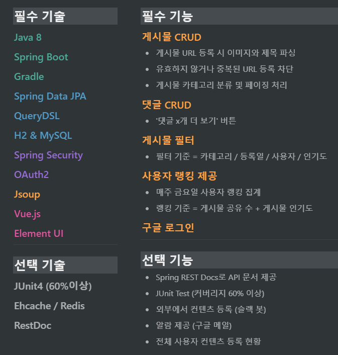
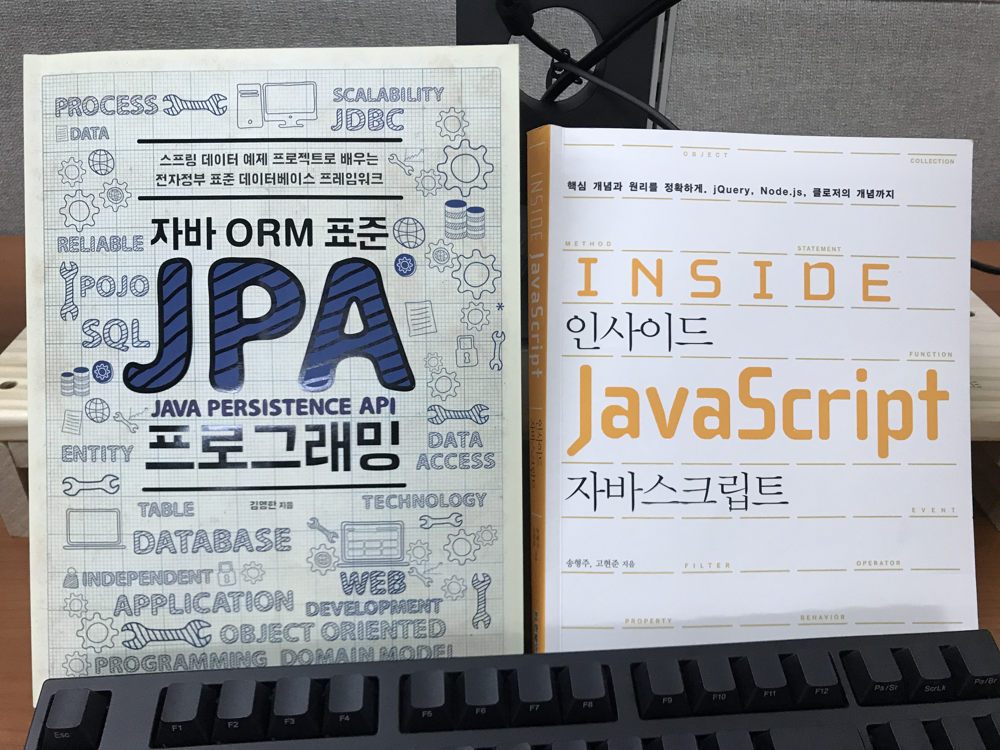

---

layout: post

title: 개발 컨텐츠 공유 서비스 - 파일럿 프로젝트

description: 파일럿 프로젝트 회고록

image: /images/portal/post/2019-04-22-ZUM-Pilot-integer/main2.png

introduction: 신입 개발자의 파일럿 프로젝트 회고록

category: portal/tech

tag: [experience, Springboot, JPA, QueryDSL, Vue.js]

---

>제가 줌인터넷 포털개발팀에서 일하고 싶었던 이유 중 하나가  
바로 `신입사원 파일럿 프로젝트` 였습니다.  
신입 개발자 혼자서 주어진 주제와 기술들로 프로젝트를 진행하고,  
함께 일 할 동료들로 부터 코드 리뷰를 받고 개선하는 과정을 꼭 경험해보고 싶었기 때문입니다.

>이 글을 통해 지난 6주간 신입 개발자로서 파일럿 프로젝트를 진행한 과정과 결과, 느낀 점을 공유하고자 합니다.

## 1. 파일럿 프로젝트 주제
저에게 주어진 파일럿 프로젝트 주제는 `개발 컨텐츠 공유 서비스`였습니다.  
유익한 개발 블로그 글이나 영상을 팀원들간에 공유할 수 있는 서비스를 만드는 것이었습니다.

(완성된 서비스의 메인 페이지)

처음 파일럿 프로젝트 주제를 들었을 때는 제 귀를 의심했습니다.  
약 5개월 전부터 개인적으로 [고퀄리티 개발 컨텐츠 모음](https://github.com/Integerous/goQuality-dev-contents)이라는 Github 저장소를 운영하고 있었는데,  
Github 저장소에 모인 데이터를 활용하여 토이 프로젝트로 만들고자 했던 서비스가  
우연히 파일럿 프로젝트의 주제로 정해진 것입니다!  

물론 팀 내에서 사용할 서비스이기 때문에 기획의 방향이 조금은 달랐지만,  
만들고 싶었던 서비스를 회사 업무의 일환으로 만들 수 있다는 것에 행복했습니다.  
<!-- (업무가 곧 취미요, 취미가 곧 업무로다!) -->

파일럿 프로젝트 **주제의 궁극적인 목표**는  
`개발 컨텐츠 공유 서비스`를 통해서 팀원들 간 기술 공유를 활성화하는 것이었습니다.  
때문에 잘 만들면 팀에서 계속 사용할 서비스가 될 수 있다는 생각에 가슴이 설레었습니다.

파일럿 프로젝트가 끝나면 버려지는 서비스가 아니라, 계속 개선해 나갈 서비스를 만들겠다고 다짐하며  
비장한 마음으로 프로젝트를 시작했습니다.

## 2. 개발 스펙

주어진 개발 스펙은 포털개발팀의 기술 스택 중 핵심적인 것들로 이루어졌습니다.  
때문에 실무에서 쓰게 될 기술들을 미리 학습하고 사용해보는 기회를 갖게 되는 점이 좋았습니다.

게다가 팀에서는 **Java 8, Spring boot, Gradle, JPA, Vue.js** 등 비교적 최신 기술들을 사용하고 있어서,  
제대로 학습하고 싶은 의지도 생기고, Documentation이 잘 되어있는 기술들이기 때문에  
학습을 위해 고대 문서(?)들을 발굴해야 할 필요도 없었습니다.

즉, 개발 외적인 부분들(기술 스택, 업무 환경) 때문에 스트레스를 받을 일은 없어서  
개발에만 온전히 집중할 수 있었습니다.

하지만 Front-end 개발은 처음이었고, JavaScript를 제대로 학습한 적이 없었습니다.  
때문에 Vue.js를 사용해서 화면을 구현해야하는 것이 마음 한 켠에 짐으로 남아있었습니다.

## 3. 개발 일정

주어진 시간은 단 6주!  
6주 안에 개발 스펙의 필수 기술을 모두 사용하여 필수 기능을 구현해야 했습니다.  

하지만 1차 리뷰는 4주 차에 예정되어 있었습니다.  
때문에 팀원들의 피드백을 제대로 받으려면 사실상 4주 안에 완성하고,  
남은 2주 간 피드백을 바탕으로 코드를 개선하거나 선택 기술/기능을 추가해야 했습니다.

생각보다 더 시간이 촉박했습니다. Vue.js는 커녕 JavaScript도 모르던 상태였고,  
MyBatis만 써봤기 때문에 ERD를 설계하고 Entity를 작성하는 시점에  
JPA에 대한 무지가 계속 발목을 잡았습니다.

마음은 선택 기술과 선택 기능들까지 모두 구현하고 싶었지만,  
일정을 계산해보니 필수 기술과 기능을 구현하는 것만으로도 벅찰 것으로 예상되었습니다.  

그래서 체계적인 일정 관리를 위해  
**Notion**으로 [파일럿 프로젝트 현황판](https://www.notion.so/integerous/4b6b1977dfe4496ca4a0df27ddf12312)을 만들어서 프로젝트 진행 상황을 관리했습니다.  

이 Notion 페이지의 URL을 팀원분들께 공유해서  
현재 무엇을 개발하고 있고, 어디까지 진행되었는지 자유롭게 확인 할 수 있도록 했습니다.

그리고 Notion에 정리한 구현 순서를 팀원분들께 보여드리면서 조언을 구했습니다.  
써보지 않은 기술들의 학습과 구현에 드는 시간을 예상하기 어려웠기 때문입니다.  
그 결과, 구현의 우선 순위를 조정하여 일정을 조금이나마 단축할 수 있었습니다.

## 4. 사전 학습

4주 안에 처음 사용해보는 기술로 서비스를 구현해야 했지만,    
기술에 대해 전혀 이해하지 않고 구현만 할 수는 없었습니다.  

그래서 1주차에는 핵심적인 기술이면서도 처음 사용해보는 기술들인  
**JPA**, **JavaScript**, **Vue.js** 를 집중적으로 학습하는 시간을 가졌습니다.

***JavaScript*** 의 경우 Vue.js를 사용하기 위한 준비 단계로 생각하고,  
'인사이드 자바스크립트'를 읽으며 기초적인 개념을 빠르게 익히는 것에 집중했습니다.  

***JPA*** 는 처음 사용해보았기 때문에 **영속성**의 개념과 **연관관계 매핑**를 우선적으로 학습하고,  
구현을 하면서 궁금한 부분 위주로 학습을 병행했습니다. (하지만 JPA 책은 6주 동안 매일 펼쳐야 했습니다.)

***Vue.js*** 는 [한글 문서](https://kr.vuejs.org/v2/guide/)에 잘 정리되어 있는 가이드로 전체적인 개념을 공부하고,  
회사에서 Inflearn(인프런)의 강의들을 지원해주기 때문에 Vue.js 강의들로 실습을 해보며  
Vue.js에 대해 알아가기 시작했습니다.

## 5. 테이블 설계

1주차에 사전학습을 빠르게 마무리하고, ERD를 작성하면서 서비스의 흐름을 구상했습니다.  

ERD 설계를 처음 해보았기 때문에, 모든 테이블을 바로 작성하기보다는  
핵심 테이블인 회원과 게시물, 댓글 테이블만 만들고 관계를 고민한 후에,  
팀원들의 피드백을 받으면서 테이블을 추가해나갔습니다. 

단순한 서비스였지만 지속적으로 팀원들의 피드백을 받으면서 ERD를 고치고 또 고치는 과정을 거쳤습니다.  
특히, 팀원분들이 실무적인 관점에서 성능 상 문제가 될 부분들을 조언해주셔서  
논리적인 관점만 생각하고 작성된 저의 ERD가 조금씩 개선될 수 있었습니다.

<!--  -->

하지만 프로젝트를 구현할수록 저의 어설픈 ERD 설계가 뒤통수를 치기 시작했습니다.  
때문에 단순한 서비스라도 설계가 정말 중요하다는 것을 6주 내내 절감했습니다.

## 6. Back-end 개발

### 6.1. Back-end 요청/응답 흐름

기본적인 Back-end 요청/응답의 흐름은 `Controller  - Service - Repository`로 이어지는 구조입니다.  

<!--  -->

더 자세한 흐름은,

1. ***Vue.js***
  - 사용자의 요청을 받아 비동기적(Axios)으로 서버에 요청을 전달
  - 받은 응답을 다시 사용자에게 전달
2. ***Controller***
  - 클라이언트로 부터 사용자의 요청을 전달 받아서 해당하는 로직을 Service 계층에 요청
  - 받은 응답을 다시 화면에 전달
3. ***Service***
  - Controller 계층에서 전달받은 요청을 처리하기 위한 Query를 Repository 계층에 요청
  - 받은 응답으로 로직 처리를 마무리
  - 결과를 Controller 계층에 전달
4. ***Repository***
  - Service 계층에서 요청한 Query로 DB에 질의
  - 결과를 다시 Service 계층에 전달
5. ***DB***
  - Repository 계층에서 질의한 Query를 수행
  - 결과를 Repository 계층에 전달

**그 외의 흐름은 2가지가 있습니다.**  
    - 팀원들의 공유 랭킹을 집계하는 로직을 ***Spring Scheduler***를 사용하여 매 주 금요일 오전 6시에 수행  
    - JPA의 쿼리 메서드로 처리하기 복잡한 쿼리들을 ***QueryDSL***로 처리

### 6.2. 사용자 랭킹 집계

팀원들이 개발 컨텐츠를 적극적으로 공유하도록 독려하기 위해, 사용자 랭킹 시스템을 구현했습니다.

오른쪽 상단에 [사용자 랭킹 보기] 버튼을 누르면 빨간색으로 표시된 최근 랭킹표가 나타납니다.

>매 주 랭킹 1위에게는 팀장님이 스타벅스 커피를 사주신다고..ㅎ

사용자 랭킹은 공유한 컨텐츠 수와 좋아요 및 댓글 수를 기준으로  
***Spring Scheduler***를 사용하여 매 주 금요일 오전 6시에 집계됩니다.

~~~java
@Scheduled(cron = "0 0 6 * * FRI")
public void countRank() {

    // 랭킹 집계 로직
}
~~~

처음에는 ***Spring Batch***를 사용할 예정이었습니다.  
팀에서 개발하는 다양한 서비스에서 Batch를 사용하고 있고,  
Batch로 구현하면 기능을 확장하기 수월하다고 생각했기 때문입니다.  

하지만 현재 기획상으로는 **Job이 랭킹을 집계하는 것 하나 뿐**이기 때문에  
**Spring Scheduler**로 충분한 상황이었습니다.  

고민을 거듭한 끝에, 기한이 정해져있는 프로젝트에서 개인적인 욕심을 채우기 보다는  
일정에 맞추는 것이 우선이라 생각되어 **Spring Scheduler**로 가볍게 구현하고,  
아쉽지만 **Spring Batch**를 학습하고 사용하는 것은 추후로 미루었습니다.

그리고 매 주 갱신되는 사용자 랭킹을 집계하기 위해서는,

>1. 지난 주에 컨텐츠를 등록한 사용자들
>2. 1번에 해당하는 각 사용자가 공유한 컨텐츠의 갯수
>3. 해당 기간에 공유한 컨텐츠에 달린 댓글 수와 좋아요 수의 합

이렇게 세 가지 데이터가 필요했습니다.  
그런데 처음에는 아래의 코드에서 처럼 3가지 데이터를 각각 DB에 요청했습니다.

(이 코드는 1차 리뷰에서 굉장히 많은 문제점을 피드백 받은 ***th레기 코드*** 입니다!!)  

~~~java
@Scheduled(cron = "0 * * ? * *") // 1분 마다 (테스트용)
public void countRank() {

    // 1. 지난 7일간 등록된 게시물 목록 가져오기
    List<Post> postsLastWeek = postRepository
            .findAllByCreatedAtBetween(LocalDateTime.now().minusWeeks(1), LocalDateTime.now());

    // 2. 게시물 작성자 목록 뽑기 (중복 제거)
    List<Member> membersLastWeek = new ArrayList<>();

    for(Post item : postsLastWeek) {
        if(!membersLastWeek.contains(item.getMember())) {
            membersLastWeek.add(item.getMember());
        }
    }

    // 3. MemberRank 세팅해서 DB에 저장
    for (Member member : membersLastWeek) {

        MemberRank memberRank = new MemberRank();
        memberRank.setMember(member);

        // 3.1. 해당 사용자가 작성한 게시물의 개수 세팅
        int postCnt = postRepository.countByMemberAndCreatedAtBetween(
                                        member,
                                        LocalDateTime.now().minusWeeks(1),
                                        LocalDateTime.now());
        memberRank.setPostCnt(postCnt);

        // 3.2. 해당 사용자가 작성한 게시물의 랭크포인트 합산 세팅
        List<Post> postByThisMember = postRepository.findAllByMemberIdxAndCreatedAtBetween(
                                                        member.getIdx(),
                                                        LocalDateTime.now().minusWeeks(1),
                                                        LocalDateTime.now());
        int postsPoints = 0;
        for (Post post : postByThisMember) {
            postsPoints += post.getRankPoint();
        }
        memberRank.setPostsPoints(postsPoints);

        // 3.3. 해당 랭크의 랭크포인트 세팅
        int postPoint = postCnt * 3 + postsPoints;
        memberRank.setRankPoint(postPoint);

        // 3.4. 각 MemberRank를 DB에 저장
        memberRankRepository.save(memberRank);
    }

    // 4. 이번주 데이터에 순위 세팅해서 DB에 저장
    List<MemberRank> memberRankList = memberRankRepository
            .findAllByCreatedAtBetweenOrderByRankPointDesc(
                    LocalDateTime.now().minusSeconds(30), LocalDateTime.now());
    
    // 5. MemberRank DB에 방금 넣은 데이터에만 순위부여 (테스트용)
    int rank = 0;
    for(MemberRank memberRank : memberRankList) {
        rank++;
        memberRank.setRank(rank);
        memberRankRepository.save(memberRank);
    }
}
~~~

다양한 문제점을 피드백 받았지만, 우선 **DB 접근 횟수 최소화**를 위해서  
필요한 데이터들을 Query 하나로 가지고 오고 싶었습니다.  

처음에는 JPA의 쿼리 메소드로 작성했지만 한계가 있었고, JPA의 **Native Query**로 작성을 시도했습니다.  
하지만 SQL 작성에 능숙하지 않아서 계속 **문법 오류**가 발생했고, 어디서 발생한 오류인지 확인이 어려웠습니다.  
그렇다고 당장 SQL 문법을 제대로 학습하기에는 시간이 부족했습니다.  

그래서 컴파일 단계에서 문법 오류를 잡을 수 있고,  
SQL 방언에 상관 없이 코드 작성하듯 쿼리를 작성할 수 있는 ***QueryDSL***을 사용하기 시작했습니다.  

QueryDSL은 개발 스펙 상 필수 기술에 속했지만,  
JPA의 쿼리 메소드만으로 쉽고 빠르게 개발이 가능했기 때문에 처음에는 사용 할 필요성을 못느꼈었습니다.  
하지만 QueryDSL을 사용하면서 왜 **Type-safe**한 것이 편리한 지 몸소 느낄 수 있었습니다.

~~~java
@RequiredArgsConstructor
public class PostRepositoryImpl implements PostRepositoryCustom{

    private final JPAQueryFactory queryFactory;

    @Override
    public List<RankCountDto> rankCount(LocalDateTime start, LocalDateTime end) {

        return queryFactory
                    .select(Projections.fields(
                            RankCountDto.class, post.member, post.member.count().as("postCnt")))
                    .from(post)
                    .groupBy(post.member)
                    .where(post.createdAt.between(start, end))
                    .fetch();
    }
~~~

위와 같이, QueryDSL을 사용해서 1번 데이터와 2번 데이터를 DB에서 한 번에 가지고 오도록 구현했습니다.  
그리고 아직도 부족한 점이 많지만 아래와 같이 랭킹 집계 로직을 개선할 수 있었습니다.

~~~java
@Scheduled(cron = "*/30 * * * * *") // 30초 마다 (테스트용)
public void countRank() {

    LocalDateTime aWeekAgo = LocalDateTime.now().minusWeeks(1);
    LocalDateTime now = LocalDateTime.now();

    // 지난주에 게시물 올린 사용자 & 등록한 게시물 수
    List<RankCountDto> rankCountLastWeek = postRepository.rankCount(aWeekAgo, now);
    List<Rank> rankList = new ArrayList<>();

    for(RankCountDto rankDto : rankCountLastWeek) {
        Member member = rankDto.getMember();
        Long postCnt = rankDto.getPostCnt();

        // 해당 사용자가 작성한 게시물의 포인트 합산 세팅
        List<Post> postsByThisMember =
                postRepository.findAllByMemberIdxAndCreatedAtBetween(member.getIdx(), aWeekAgo, now);

        Long postsPoints = 0L;

        for (Post post : postsByThisMember) {
            postsPoints += post.getRankPoint();
        }

        // 랭크포인트 세팅
        Long rankPoint = postCnt * 3 + postsPoints;

        // Rank 생성
        Rank rank = Rank.builder()
                .countDay(now)
                .postCnt(postCnt)
                .postsPoints(postsPoints)
                .rankPoint(rankPoint)
                .member(member)
                .build();

        // 리스트에 저장
        rankList.add(rank);
    }

    // 랭킹포인트 높은 순서로 정렬
    rankList.sort(new Comparator<Rank>() {
        @Override
        public int compare(Rank o1, Rank o2) {
            if(o1.getRankPoint() > o2.getRankPoint()) {
                return -1;
            } else if(o1.getRankPoint() < o2.getRankPoint()) {
                return 1;
            }
            return 0;
        }
    });

    // 랭킹 세팅
    int ranking = 0;
    for (Rank rank : rankList) {
        ranking++;
        rank.setRanking(ranking);
    }

    rankRepository.saveAll(rankList);
}
~~~

### 6.3. 컨텐츠 필터와 페이징 처리

저는 이 서비스가 페이스북이나 인스타그램 처럼 **가볍게, 자주 사용되길 바라는 마음으로 개발**했습니다.  
때문에 페이징 처리도 **무한 스크롤**을 적용했습니다.

하지만 [무한스크롤, 페이징 혹은 "더보기" 버튼? 어떤 걸 써야할까](https://cyberx.tistory.com/82) 라는 글을 읽고 무한 스크롤의 단점들을 알게 되었고, 다양한 기준(카테고리, 사용자, 등록일, 인기도)의 게시물 필터 기능을 넣어서 이를 보완하고자 했습니다.

그런데 게시물이 필터링 된 상태에서 무한스크롤이 동작하면, 필터링 된 게시물들만 DB에 요청해야 하기 때문에 아래의 코드처럼 각 필터별로 다른 Query를 날려야 했습니다.

~~~java
/**
 * 게시물 Top10 (기준: 댓글 수 + 좋아요 수)
 * @return 인기순 상위 10개 게시물
 */
public Page<PostResponseDto> listTopTen() {

    PageRequest pageRequest = PageRequest.of(0, 10, Sort.Direction.DESC, "rankPoint", "likeCnt");
    return postRepository.findAll(pageRequest).map(PostResponseDto::new);
}

/**
 * 게시물 필터 (Tag Name)
 * @param tagName 게시물 박스에서 클릭한 태그 이름
 * @param pageable 페이징 처리를 위한 객체
 * @return 해당 태그가 포함된 게시물 목록
 */
public Page<PostResponseDto> listFilteredByTagName(String tagName, Pageable pageable) {

    return postRepository.findAllByTagName(tagName, pageable).map(PostResponseDto::new);
}

// ... 게시물 필터 (Member) 생략 

/**
 * 게시물 필터 (Date)
 * @param createdDate 게시물 박스에서 클릭한 날짜
 * @return 해당 날짜에 등록된 게시물 목록
 */
public List<PostResponseDto> listFilteredByDate(String createdDate) {

    // 등록일 00시부터 24시까지
    LocalDateTime start = LocalDateTime.of(LocalDate.parse(createdDate), LocalTime.MIN);
    LocalDateTime end = LocalDateTime.of(LocalDate.parse(createdDate), LocalTime.MAX);

    return postRepository
                    .findAllByCreatedAtBetween(start, end)
                    .stream()
                    .map(PostResponseDto::new)
                    .collect(Collectors.toList());
    }
~~~

이 때 **카테고리(tag)**로 게시물을 필터링 하는 경우,  
각 게시물은 최대 3개까지의 카테고리(tag)를 가질 수 있기 때문에 해당 카테고리를 포함하는 모든 게시물을 질의해야 했기 때문에, **QueryDSL**을 사용하여 다소 복잡한 Query를 작성하면서도 페이징 처리를 할 수 있었습니다.

~~~java
/**
 * 게시물 필터 (Tag Name)
 */
@Override
public Page<Post> findAllByTagName(String tagName, Pageable pageable) {

    QueryResults<Post> results = queryFactory
            .selectFrom(post)
            .innerJoin(postTag)
                .on(post.idx.eq(postTag.post.idx))
            .innerJoin(tag)
                .on(tag.idx.eq(postTag.tag.idx))
            .where(tag.name.eq(tagName))
            .orderBy(post.idx.desc())
                .limit(pageable.getPageSize())
                .offset(pageable.getOffset())
            .fetchResults();

    return new PageImpl<>(results.getResults(), pageable, results.getTotal());
}
~~~

## 7. 핵심 기능의 흐름
이 서비스의 핵심 기능은 **컨텐츠 등록** 기능입니다.  
사용자는 단지 컨텐츠의 카테고리를 선택하고, URL만 입력하면 끝입니다.  
이 단순한 기능의 흐름을 보면, 서비스가 어떻게 동작하는지 알 수 있습니다.

### 7.1. 전체 흐름

### 7.2. 사용자 요청

- **URL 정규식 체크**
  - Vue.js로 렌더링된 화면단에서, 사용자가 등록을 시도한 URL의 모양새를 정규식으로 확인합니다.
  - URL의 모양새가 아닌 경우, 에러 메세지를 띄웁니다.
- **Axios 비동기 요청**
  - URL의 모양새인 경우, 컨텐츠를 등록하는 POST 요청을 비동기로 날립니다.

### 7.3. Controller 

- **요청 처리**
  - Controller에서는 요청을 화면단에서 넘어온 요청을 받고, Service 계층에 로직 처리를 위임합니다.
- **결과 응답**
  - Service 계층에서 넘어온 로직 처리 결과(메세지)를 화면단에 응답해줍니다.

### 7.4. Service

- **Http 프로토콜 추가 및 trim()**
  - 사용자가 URL 입력 시 Http 프로토콜을 생략하거나 공백을 넣은 경우,  
  올바른 URL이 될 수 있도록 Http 프로토콜을 추가해주고, 공백을 제거해줍니다.

- **URL 접속 확인**
  - 화면단에서 모양새만 확인한 URL이 실제 리소스로 연결되는지 `HttpUrlConnection`으로 테스트합니다.
  - 이 때, 빠른 응답을 위해 Request Method를 **GET이 아닌 HEAD를 사용**했습니다.  
  (HEAD 메소드는 GET 메소드의 응답 결과의 Body는 가져오지 않고, Header만 확인하기 때문에 GET 메소드에 비해 응답속도가 빠릅니다.)
  

- **Jsoup 이미지, 제목 파싱**
  - URL 접속 확인결과 유효하면 Jsoup을 사용해서 입력된 URL의 이미지와 제목을 파싱합니다.
  - 이미지는 Open Graphic Tag를 우선적으로 파싱하고, 없을 경우 첫 번째 이미지와 제목을 파싱합니다.
  - 컨텐츠에 이미지가 없을 경우, 미리 설정해둔 기본 이미지를 사용하고, 제목이 없을 경우 생략합니다.

### 7.5. Repository

- **컨텐츠 저장**
  - URL 유효성 체크와 이미지, 제목 파싱이 끝난 컨텐츠는 DB에 저장합니다.
  - 저장된 컨텐츠는 다시 Repository - Service - Controller를 거쳐 화면단에 송출됩니다.

## 8. Front-end 개발

Front-end 개발은 처음이었기 때문에 아예 감이 없었습니다.  
그 전까지는 Front-end 개발을 **화면을 꾸미는 일** 정도로 생각했는데 크나큰 착각이었습니다.

1주 차에 사전학습을 하면서 쉬운 편에 속한다는 Vue.js를 공부했음에도 Front-end 개발이 쉽지 않다는 생각이 들었고, 개발이 진행될수록 Front-end 개발이 Back-end 개발보다 더 어렵게 느껴졌습니다.  

특히, JavaScript 개념이 약한 상태에서 Vue.js의 생명주기를 고려하며 개발하는 것은 쉽지 않았습니다.  
하지만 서비스의 구조가 단순했기 때문에 Front-end의 구조도 비교적 단순하게 구성할 수 있었습니다.

### 8.1. Front-end 프로젝트 구조

Front-end 코드는 frontend 폴더에 모아서 Back-end 코드와 구분했습니다.  
꼭 구분해야 하는 것은 아니었지만, Front-end 개발에 익숙하지 않은 상황이라  
Back-end 코드와 별개로 생각하고 관리하고 싶었습니다.

### 8.2. Vue.js 컴포넌트 구조

싱글 페이지로 구현했기 때문에 컴포넌트의 구조와 역할은 단순했습니다.  
추후에 더 많은 기능을 개발한다면 Vuex 등의 상태관리 도구가 필요할 것으로 생각됩니다.

### 8.3. Vue.js 컴포넌트 계층

기본적으로 **App.vue** 라는 최상위 컴포넌트와 자식 컴포넌트들로 구분했습니다.  
그리고 **PostList** 컴포넌트의 경우 게시물 목록이기 때문에 **PostItem** 컴포넌트를 내포하고 있고,  
**PostItem**은 댓글에 해당하는 **PostComment** 컴포넌트를 내포하고 있는 형태입니다.  

때문에 각 컴포넌트에서 발생한 Event를 **App.vue** 컴포넌트로 올려서(Event emit)  
모든 API 콜을 **App.vue**에서 담당하고, 그 결과를 자식 컴포넌트들에 내려주는 방식(Props down)으로 구현했지만, **App.vue**까지 올라가기 번거로운 **PostItem** 컴포넌트와 **PostComment** 컴포넌트의 Event는 자체적으로 API 콜을 요청하고 응답받도록 구현했습니다.

### 8.4. Vue.js의 watch를 이용한 무한 스크롤 구현
Vue.js는 Vue 인스턴스의 데이터 변경을 관찰하고 이에 반응하는 watch 속성을 제공합니다.  
저는 이 watch 속성을 이용해서 비동기적으로 사용자의 스크롤 변화를 감지했고,  
스크롤이 바닥에 닿으면 그 다음 페이지를 로딩하도록 구현했습니다.

우선, 컴포넌트 초기화 단계(created())에서부터 스크롤을 감지하기 시작합니다.

~~~javascript
created() {
      // 스크롤 감지
      window.addEventListener('scroll', () => {
        this.bottom = this.bottomVisible();
      });

    },
~~~ 

아래의 `bottomVisible()` 메소드로 스크롤이 바닥에 닿았는지 체크하고, bottom 변수에 결과를 담습니다.

~~~javascript

bottomVisible() {
    let scrollY = window.pageYOffset; // 스크롤되어 올라간 높이 (이미 지나간 화면 높이)
    let visible = document.documentElement.clientHeight; // 화면 높이
    let pageHeight = document.documentElement.scrollHeight; // 전체 높이
    let bottomOfPage = visible + scrollY >= pageHeight;

    return bottomOfPage || pageHeight < visible;
},
~~~

만약 스크롤이 바닥에 닿았을 경우, watch 속성이 bottom 변수의 변화를 감지해서  
그 다음 페이지를 로딩하는 로직을 실행시킵니다.

~~~javascript
watch: {
    bottom(bottom) {
        if(bottom && !this.lastPage) {
            this.loading = true; // 로딩스피너 시작
            this.page += 1;

            if((this.page + 1) * 5 >= this.propsPosts.length) {
                setTimeout(() => {
                    this.loading = false; // 로딩스피너 종료
                    this.$emit('addList', this.page); // 다음 페이지 게시물들 추가
                }, 200);
            }
        }
    }
}
~~~

로직이 실행되면, 다음 페이지 로딩시 로딩스피너가 돌기 시작합니다.  
이 때, 사용자가 인지할 수 있도록 0.2초의 텀을 주고 로딩스피너를 종료합니다.

## 9. 느낀 점
개발 공부를 시작한 지 1년이 지났지만 프로젝트를 제대로 끝내 본 경험이 없었는데,  
파일럿 프로젝트를 하면서 처음으로 하나의 서비스를 완성할 수 있었습니다.  

책이나 온라인 강의에 있는 예제를 따라서 서비스를 만들어 보는 것과,  
서비스의 A부터 Z까지 직접 만들어보는 것은 정말 하늘과 땅의 차이라는 것을 깨달았습니다.  

책이나 강의에서는 제대로 동작하는 코드만 나와있지만,  
직접 서비스를 설계하고 개발할 때에는 내가 생각해낸 코드와 구글링한 코드를 사용하기 때문에  
훨씬 많은 문제와 마주해야 했습니다.  

그리고 그 문제들을 해결하는 과정에서 제대로 이해하지 못하고 있던 개념들을 발견할 수 있었고,  
밤낮 없이 고민하고 헤매다가 문제를 해결했을 때는 개발의 참 재미를 느낄 수 있었습니다.

파일럿 프로젝트를 하기 전까지의 저는 **'개발 = 무언가를 만드는 일'** 이라고 스스로 정의했다면,  
파일럿 프로젝트를 마친 지금은 **'개발 = 문제를 해결하는 일'** 이라고 다시 정의하게 되었습니다.  

앞으로 포털개발팀에서 실제 서비스를 개발하면 더 어렵고 힘든 문제들을 마주하겠지만,  
끊임 없이 공부하고 팀원들과 함께 고민한다면  
결국 어떠한 문제라도 해결할 수 있다는 자신감이 생겼습니다! 

긴 글 읽어주셔서 감사합니다!

