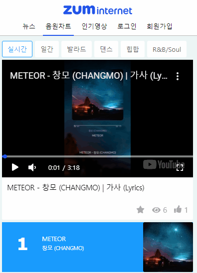
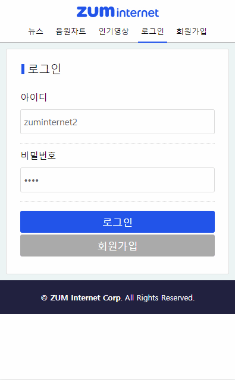
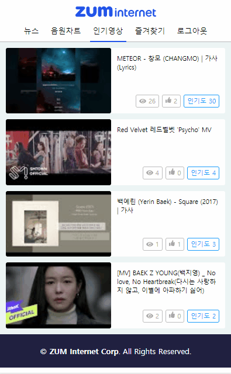

---

sidebarDepth: 2

---

# 결과물 소개

프로젝트 결과물에  대한 소개 페이지입니다.

## 1. K-POP 뉴스

[빌보드 코리아](http://billboard.co.kr/main/news/list)와 [SBS K-POP](http://sbsfune.sbs.co.kr/news/ssports_list.jsp?code_category=SS04)의 뉴스 컨텐츠를 `크롤링`하여 가져옵니다.

### 빌보드 코리아 크롤링

빌보드 코리아의 뉴스는 `Headline Swipe` 형태로 만들었습니다.

### SBS K-POP 크롤링

- SBS K-POP 뉴스는 `infinite scroll` 기법을 이용하여 만들었습니다. 최대 `5 페이지` 를 가져옵니다.
- 크롤링한 데이터는 `캐시에 저장`되며, `1분 간격으로 크롤링`을 합니다.

### 뉴스 상세 조회

뉴스 상세조회는 `Native App` 에서 사용되는 `Bottom-top slide` 형태로 만들었으며, 결과물을 크롤링하여 가져오도록 했습니다.  

## 2. 음원차트

음원차트는 [멜론 차트](https://www.melon.com/chart/index.htm)의 컨텐츠를 크롤링하여 메타 데이터로 사용했습니다.

- 멜론에서 음원차트를 크롤링하여 가져옵니다.

- **100개의 음원**을 `Infinite Scroll` 기법을 이용하여 가져옵니다.
- `실시간` `일간` `발라드` `댄스` `힙합` `R&B/Soul` 등 6개의 카테고리가 존재합니다.

## 3. 음원차트에 대한 유튜브 동영상

`Youtube Search API`를 이용하여 `음원 제목을 기반`으로 동영상을 가져옵니다.

- 음원은 클릭하면 **음원에 대한 유튜브 동영상**을 재생합니다.
- 플레이어에서 **Swipe 모션**을 사용하면 `이전/다음 음원에 대한 동영상`을 재생합니다.

- `직접 제작한 컨트롤러`를 통해서 동영상을 컨트롤할 수 있습니다.
  - 정지/재생 토글
  - 음소거 토글
  - 재생 시간 컨트롤
  - 최대화/최소화

## 4. 회원가입/로그인

서비스에 회원가입 및 로그인을 할 수 있으며, `로그인 상태의 사용자는 즐겨찾기/좋아요 기능을 사용`할 수 있습니다. 

### 비회원의 제한

- 비회원은 좋아요와 즐겨찾기 기능을 이용할 수 없습니다. 

### 회원가입

- 회원가입 페이지에서 `아이디` `비밀번호` `이름` 등을 입력받습니다.
- 중복된 아이디가 있으면 `경고창(Modal Popup)`을 통해 알립니다.
- 회원가입이 완료되면 `로그인 페이지로 이동`합니다.

### 로그인

- 사용자가 입력한 정보가 잘못되었다면 `경고창(Modal Popup)`을 통해 알립니다.
- 로그인에 성공하면 `메인 페이지(뉴스)로 이동`합니다.

### 즐겨찾기와 좋아요

- 로그인 상태의 사용자는 즐겨찾기와 좋아요 기능을 이용할 수 있습니다.

## 5. 인기영상

동영상의 **조회수**와 **좋아요**를 기반으로 순위를 측정하여 인기영상 목록을 만듭니다.

`인기도 = 조회수 + (좋아요 * 2)`

### 좋아요 토글

- 로그인 상태의 사용자는 `좋아요 토글` 기능을 사용할 수 있습니다.
- 좋아요를 누르면 `인기도가 2 증가`합니다.

### 조회수 처리

- 동영상 재상이 끝나면 조회수가 증가합니다.
- 조회수가 증가하면 `인기도가 1 증가`합니다.